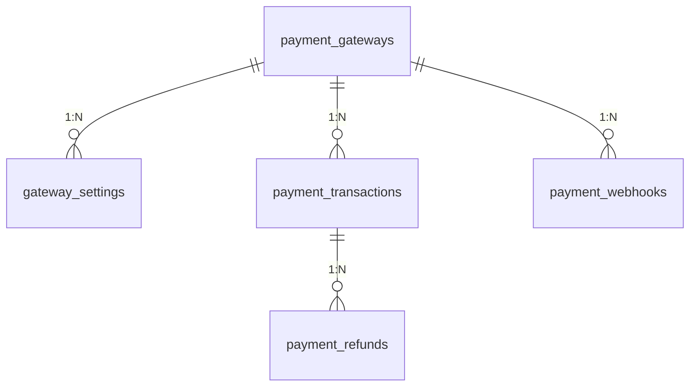

### **Система таблиц для интеграции платежных систем**

Вот структура базы данных для управления платежными системами в Laravel-приложении. Она поддерживает:
- Множественные платежные шлюзы  
- Тестовый и боевой режимы  
- Историю транзакций  
- Возвраты и вебхуки  

---

## **1. Основные таблицы**

### **Таблица `payment_gateways` (Платежные шлюзы)**
```sql
CREATE TABLE `payment_gateways` (
  `id` BIGINT UNSIGNED AUTO_INCREMENT PRIMARY KEY,
  `name` VARCHAR(50) NOT NULL COMMENT 'Название (YooKassa, PayPal)',
  `slug` VARCHAR(30) UNIQUE NOT NULL COMMENT 'yookassa, paypal',
  `is_active` BOOLEAN DEFAULT TRUE,
  `test_mode` BOOLEAN DEFAULT TRUE,
  `created_at` TIMESTAMP DEFAULT CURRENT_TIMESTAMP,
  `updated_at` TIMESTAMP DEFAULT CURRENT_TIMESTAMP ON UPDATE CURRENT_TIMESTAMP
);
```
**Пример данных:**
| id | name      | slug      | is_active | test_mode |
|----|-----------|-----------|-----------|-----------|
| 1  | YooKassa  | yookassa  | 1         | 0         |
| 2  | PayPal    | paypal    | 1         | 1         |

---

### **Таблица `gateway_settings` (Настройки шлюзов)**
```sql
CREATE TABLE `gateway_settings` (
  `id` BIGINT UNSIGNED AUTO_INCREMENT PRIMARY KEY,
  `gateway_id` BIGINT UNSIGNED NOT NULL,
  `key` VARCHAR(50) NOT NULL COMMENT 'shop_id, secret_key',
  `test_value` TEXT COMMENT 'Для test_mode',
  `live_value` TEXT COMMENT 'Для боевого режима',
  `is_encrypted` BOOLEAN DEFAULT FALSE,
  FOREIGN KEY (`gateway_id`) REFERENCES `payment_gateways`(`id`) ON DELETE CASCADE
);
```
**Пример данных (YooKassa):**
| id | gateway_id | key        | test_value           | live_value           |
|----|------------|------------|----------------------|----------------------|
| 1  | 1          | shop_id    | 'test_shop_123'      | 'live_shop_456'      |
| 2  | 1          | secret_key | 'test_key_abc'       | 'live_key_def'       |

---

### **Таблица `payment_transactions` (Транзакции)**
```sql
CREATE TABLE `payment_transactions` (
  `id` BIGINT UNSIGNED AUTO_INCREMENT PRIMARY KEY,
  `gateway_id` BIGINT UNSIGNED NOT NULL,
  `order_id` VARCHAR(50) NOT NULL COMMENT 'ID заказа в вашей системе',
  `payment_id` VARCHAR(100) COMMENT 'ID платежа в шлюзе',
  `amount` DECIMAL(12, 2) NOT NULL,
  `currency` CHAR(3) DEFAULT 'RUB',
  `status` ENUM('pending', 'success', 'failed', 'refunded') DEFAULT 'pending',
  `metadata` JSON COMMENT 'Доп. данные (items, user_id)',
  `created_at` TIMESTAMP DEFAULT CURRENT_TIMESTAMP,
  `updated_at` TIMESTAMP DEFAULT CURRENT_TIMESTAMP ON UPDATE CURRENT_TIMESTAMP,
  FOREIGN KEY (`gateway_id`) REFERENCES `payment_gateways`(`id`)
);
```
**Пример данных:**
| id | gateway_id | order_id | payment_id | amount | status  |
|----|------------|----------|------------|--------|---------|
| 1  | 1          | ORDER-1  | PAY-123    | 100.00 | success |

---

### **Таблица `payment_webhooks` (Вебхуки)**
```sql
CREATE TABLE `payment_webhooks` (
  `id` BIGINT UNSIGNED AUTO_INCREMENT PRIMARY KEY,
  `gateway_id` BIGINT UNSIGNED NOT NULL,
  `payload` JSON NOT NULL COMMENT 'Raw данные от шлюза',
  `event_type` VARCHAR(50) NOT NULL COMMENT 'payment.succeeded',
  `processed` BOOLEAN DEFAULT FALSE,
  `created_at` TIMESTAMP DEFAULT CURRENT_TIMESTAMP,
  FOREIGN KEY (`gateway_id`) REFERENCES `payment_gateways`(`id`)
);
```

---

### **Таблица `payment_refunds` (Возвраты)**
```sql
CREATE TABLE `payment_refunds` (
  `id` BIGINT UNSIGNED AUTO_INCREMENT PRIMARY KEY,
  `transaction_id` BIGINT UNSIGNED NOT NULL,
  `refund_id` VARCHAR(100) COMMENT 'ID возврата в шлюзе',
  `amount` DECIMAL(12, 2) NOT NULL,
  `reason` TEXT,
  `status` ENUM('pending', 'completed', 'failed'),
  `created_at` TIMESTAMP DEFAULT CURRENT_TIMESTAMP,
  FOREIGN KEY (`transaction_id`) REFERENCES `payment_transactions`(`id`)
);
```

---

## **2. Связи между таблицами**


---

## **3. Миграции для Laravel**
```bash
php artisan make:model PaymentGateway -m
php artisan make:model GatewaySetting -m
php artisan make:model PaymentTransaction -m
php artisan make:model PaymentWebhook -m
php artisan make:model PaymentRefund -m
```

Пример миграции для `payment_gateways`:
```php
Schema::create('payment_gateways', function (Blueprint $table) {
    $table->id();
    $table->string('name', 50);
    $table->string('slug', 30)->unique();
    $table->boolean('is_active')->default(true);
    $table->boolean('test_mode')->default(true);
    $table->timestamps();
});
```

---

## **4. Как использовать?**
1. **Добавление шлюза**:
   ```php
   PaymentGateway::create([
       'name' => 'YooKassa',
       'slug' => 'yookassa',
       'test_mode' => true
   ]);
   ```

2. **Настройка YooKassa**:
   ```php
   GatewaySetting::create([
       'gateway_id' => 1,
       'key' => 'shop_id',
       'test_value' => 'test_shop_123',
       'live_value' => 'live_shop_456'
   ]);
   ```

3. **Создание транзакции**:
   ```php
   PaymentTransaction::create([
       'gateway_id' => 1,
       'order_id' => 'ORDER-1',
       'amount' => 100.00,
       'status' => 'pending'
   ]);
   ```

---

## **5. Плюсы системы**
✅ **Гибкость** – поддержка любых платежных систем  
✅ **Безопасность** – чувствительные данные можно шифровать  
✅ **Аналитика** – история всех транзакций и возвратов  
✅ **Масштабируемость** – легко добавить новый шлюз  

Для реализации осталось только:
1. Написать логику обработки платежей  
2. Реализовать контроллеры для вебхуков  
3. Добавить UI для управления шлюзами в админке

---

# **Назначение таблицы `payment_webhooks` и бизнес-цикл работы**

## **1. Зачем нужна таблица `payment_webhooks`?**
Эта таблица решает 3 ключевые задачи:

1. **Хранение сырых данных**  
   Фиксирует оригинальные запросы от платежных систем (YooKassa, PayPal и др.) для аудита и отладки.

2. **Асинхронная обработка**  
   Позволяет обрабатывать вебхуки в фоновом режиме (через очереди), избегая таймаутов.

3. **Гарантия доставки**  
   Если система упала во время обработки — данные не потеряются и могут быть обработаны позже.

---

## **2. Бизнес-цикл работы вебхуков**

### **Шаг 1: Платежный шлюз отправляет вебхук**
Пример запроса от YooKassa (упрощенно):
```json
{
  "event": "payment.succeeded",
  "object": {
    "id": "pay_123",
    "status": "succeeded",
    "amount": {"value": "1000.00", "currency": "RUB"},
    "metadata": {"order_id": "ORDER-1"}
  }
}
```

### **Шаг 2: Ваш сервер принимает вебхук**
1. Данные **сохраняются в `payment_webhooks`**:
   ```sql
   INSERT INTO payment_webhooks 
   (gateway_id, payload, event_type, processed) 
   VALUES 
   (1, '{"event":"payment.succeeded",...}', 'payment.succeeded', FALSE);
   ```
2. Возвращается HTTP 200 OK (подтверждение получения).

### **Шаг 3: Фоновая обработка (через очереди)**
- **Задача из очереди** берет необработанный вебхук (`processed = FALSE`).
- **Логика обработки**:
  ```php
  $webhook = PaymentWebhook::where('processed', false)->first();
  
  if ($webhook->event_type === 'payment.succeeded') {
      $payment = PaymentTransaction::where('payment_id', $webhook->payload['object']['id'])->first();
      $payment->update(['status' => 'success']);
      
      Order::where('id', $payment->order_id)->update(['status' => 'paid']);
  }
  
  $webhook->update(['processed' => true]);
  ```

### **Шаг 4: Обновление статусов**
- Платеж помечается как успешный в `payment_transactions`.
- Заказ переходит в статус "Оплачен" в системе.

---

## **3. Какие события обычно обрабатывают?**
| Тип вебхука              | Действие в системе                     |
|--------------------------|----------------------------------------|
| `payment.succeeded`      | Подтвердить оплату заказа              |
| `payment.canceled`       | Отменить заказ                         |
| `refund.succeeded`       | Вернуть деньги клиенту                 |
| `chargeback.created`     | Обработать спор по платежу             |

---

## **4. Поля таблицы и их назначение**
| Поле           | Тип       | Описание                                                                 |
|----------------|-----------|-------------------------------------------------------------------------|
| `id`           | BIGINT    | Уникальный ID записи                                                   |
| `gateway_id`   | BIGINT    | Ссылка на платежный шлюз (`payment_gateways.id`)                       |
| `payload`      | JSON      | **Сырые данные** от шлюза (для аудита)                                 |
| `event_type`   | VARCHAR   | Тип события (`payment.succeeded`, `refund.created`)                    |
| `processed`    | BOOLEAN   | Флаг обработки (защита от дублирования)                                |
| `created_at`   | TIMESTAMP | Время получения вебхука                                                |

---

## **5. Примеры SQL-запросов**
**1. Найти необработанные вебхуки:**
```sql
SELECT * FROM payment_webhooks 
WHERE processed = FALSE 
ORDER BY created_at DESC;
```

**2. Статистика по событиям:**
```sql
SELECT event_type, COUNT(*) as count 
FROM payment_webhooks 
GROUP BY event_type;
```

---

## **6. Защита и валидация**
1. **Проверка подписи**  
   Каждый шлюз (YooKassa, PayPal) подписывает вебхуки. Пример для YooKassa:
   ```php
   $signature = $_SERVER['HTTP_CONTENT_SIGNATURE'];
   $content = file_get_contents('php://input');
   $valid = openssl_verify($content, base64_decode($signature), $publicKey, 'sha256');
   ```

2. **Идемпотентность**  
   Обработка одного вебхука должна быть безопасной при повторах (проверка `processed`).

---

## **7. Интеграция с Laravel**
**Контроллер для вебхуков:**
```php
class WebhookController extends Controller 
{
    public function handle(Request $request, $gatewaySlug) 
    {
        $gateway = PaymentGateway::where('slug', $gatewaySlug)->firstOrFail();
        
        // Сохраняем вебхук в БД
        $webhook = PaymentWebhook::create([
            'gateway_id' => $gateway->id,
            'payload' => $request->all(),
            'event_type' => $request->input('event'),
        ]);
        
        // Добавляем в очередь на обработку
        ProcessWebhook::dispatch($webhook);
        
        return response()->json(['status' => 'received']);
    }
}
```

**Job для обработки:**
```php
class ProcessWebhook implements ShouldQueue 
{
    public function handle() 
    {
        // Логика обновления платежа и заказа...
        $this->webhook->update(['processed' => true]);
    }
}
```

---

## **Вывод**
Таблица `payment_webhooks` — это **надежный буфер** между платежными шлюзами и вашей системой. Она:
✅ Фиксирует все события  
✅ Гарантирует обработку даже при сбоях  
✅ Позволяет анализировать платежи  

Без нее риски:
❌ Потеря данных при ошибках  
❌ Невозможность отладки  
❌ Дублирование платежей