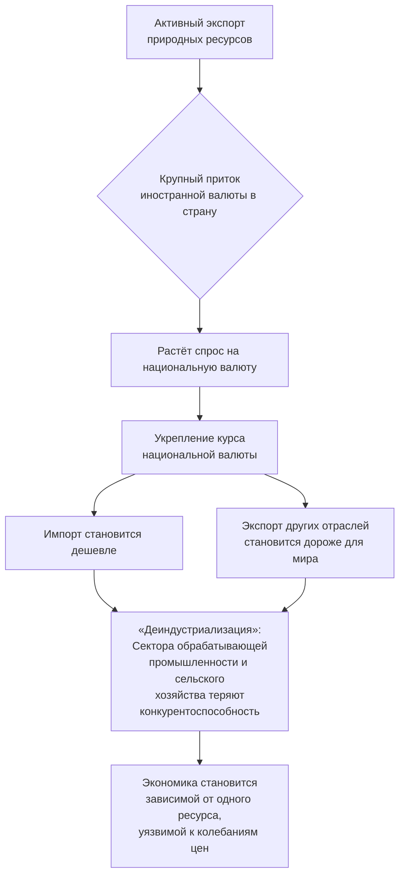

Конечно, вот краткий конспект, объясняющий **«голландскую болезнь»** (англ. *Dutch Disease*) — ключевую экономическую концепцию, на которую ссылается автор.

---

### 📘 **Мини-конспект: «Голландская болезнь» экономики**

#### 🎯 **Что это такое?**
«Голландская болезнь» — это **парадоксальная ситуация**, когда открытие и активный экспорт ценных природных ресурсов (нефть, газ, руды) в долгосрочной перспективе **не укрепляют, а ослабляют национальную экономику**, вызывая деградацию других секторов. Термин возник в 1970-х годах после открытия газовых месторождений в Нидерландах, экономика которых столкнулась с подобными проблемами.

#### 🔄 **Механизм развития болезни (пошагово)**
На схеме ниже показан классический цикл «голландской болезни»:

По сути, происходит **перекачивание капитала и труда** из технологичных и обрабатывающих отраслей в более прибыльный сырьевой сектор и сферу услуг, связанных с потреблением новой ренты.

#### 📉 **Основные последствия**
*   **Для экономики:** Потеря конкурентоспособности и сокращение несырьевого экспорта («деиндустриализация»).
*   **Для бюджета:** Зависимость доходов от мировой цены на один ресурс (бюджетная неустойчивость).
*   **Для общества:** Рост социального неравенства, региональные диспропорции, «инфляция богатства» (рост цен и зарплат в сырьевом секторе обгоняет другие отрасли).
*   **В долгосрочной перспективе:** Экономика становится уязвимой. Когда цены на ресурс падают, наступает глубокий кризис, так как другие секторы уже разрушены.

#### 🇷🇺 **Как это связано с Россией и словами автора?**
*   **Реальность до 2022 года:** Симптомы «голландской болезни» были ярко выражены в России. Курс рубля сильно коррелировал с ценой на нефть, а обрабатывающая промышленность (кроме ВПК) и сельское хозяйство (до 2014 года) развивались с трудом.
*   **Тезис автора «сырьевая колония»:** Его утверждение, что экономика и курс рубля полностью зависят от экспорта ресурсов, — это и есть народное описание экономики, страдающей от «голландской болезни». Он описывает её финальную стадию: «**Мы продаём нефть, получаем валюту, от этого зависит всё**».

#### 💡 **Как лечат «голландскую болезнь»?**
Обычные меры включают:
1.  **Стерилизация избыточной валюты:** Создание **суверенного фонда** (как ФНБ в России), куда направляются сверхдоходы от ресурсов. Фонд инвестируется за рубежом, чтобы не перегревать внутреннюю экономику.
2.  **Сдерживание роста курса:** Валютные интервенции ЦБ, как это и делал Банк России.
3.  **Целевые инвестиции:** Направление части ресурсных доходов в развитие инфраструктуры, образования, технологий и поддержку несырьевого экспорта.

Таким образом, **«голландская болезнь» — это не критика сырьевого сектора как такового, а диагноз несбалансированной экономической политики, которая позволяет «легким деньгам» от ресурсов подавлять остальные отрасли.** Автор Александра Григорьева именно этот дисбаланс и называет признаком «сырьевой колонии».