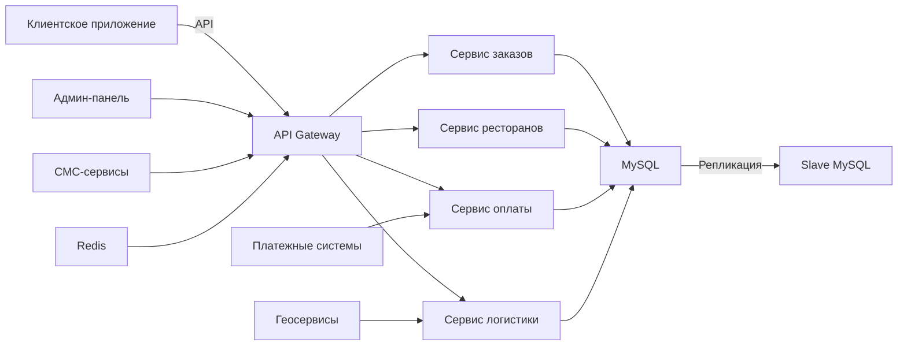
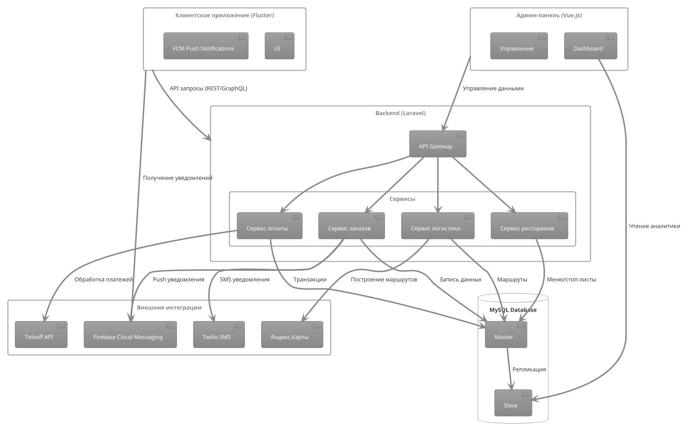

### **2. Проектирование программного комплекса**  

#### **2.1. Архитектура системы**  

##### **Выбор технологий**  
Для разработки программного комплекса были выбраны следующие технологии:  

- **Backend**:  
  - **Laravel (PHP)** – фреймворк с богатой экосистемой, поддерживающий REST API, очереди задач и удобную работу с БД.  
  - **MySQL** – реляционная СУБД для хранения структурированных данных (меню, заказы, пользователи).  
  - **Redis** – кэширование и управление сессиями для повышения производительности.  

- **Frontend**:  
  - **Flutter (Dart)** – кроссплатформенный фреймворк для мобильных приложений (iOS/Android) и веб-интерфейсов.  
  - **Vue.js** – для административной панели (управление ресторанами, курьерами, аналитика).  

- **Инфраструктура**:  
  - **Docker** – контейнеризация для упрощения развертывания.  
  - **Nginx** – веб-сервер и балансировщик нагрузки.  
  - **WebSocket** – для real-time уведомлений (статусы заказов).  

##### **Схема взаимодействия компонентов**  
Система строится по **модульной микросервисной архитектуре**:  

1. **Клиентское приложение (Flutter)**:  
   - Отправляет запросы к API (Laravel) для получения меню, оформления заказов.  
   - Получает push-уведомления через Firebase Cloud Messaging (FCM).  

2. **Backend (Laravel)**:  
   - **API Gateway**: Единая точка входа для всех запросов.  
   - **Сервис заказов**: Обрабатывает создание, изменение и статусы заказов.  
   - **Сервис ресторанов**: Управляет меню, стоп-листами, графиком работы.  
   - **Сервис оплаты**: Интегрируется с Tinkoff, СБП, PayPal.  
   - **Сервис логистики**: Оптимизирует маршруты курьеров (интеграция с Яндекс.Карты).  

3. **Админ-панель (Vue.js)**:  
   - Визуализация данных (графики продаж, активные заказы).  
   - Управление пользователями и настройками системы.  

4. **База данных (MySQL)**:  
   - Таблицы: `users`, `orders`, `restaurants`, `couriers`, `payments`.  
   - Репликация Master-Slave для отказоустойчивости.  

5. **Внешние интеграции**:  
   - **Платежные системы** (Tinkoff API).  
   - **Геосервисы** (Яндекс.Карты для маршрутизации).  
   - **SMS-рассылки** (Twilio для уведомлений клиентов).  

```mermaid
graph TD
  A[Клиент (Flutter)] -->|API запросы| B[Laravel Backend]
  B --> C[MySQL]
  B --> D[Redis]
  B --> E[Сервис оплаты]
  B --> F[Сервис логистики]
  G[Админ-панель (Vue.js)] --> B
  H[Курьер (Flutter)] --> B
  E -->|Tinkoff API| I[Банковские системы]
  F -->|Яндекс.Карты| J[Геоданные]
```

#### **2.2. Модульная структура**  
##### **Ключевые модули**:  
1. **Модуль заказов**:  
   - Создание, редактирование, отмена.  
   - Автоматическое распределение заказов курьерам.  

2. **Модуль ресторанов**:  
   - Личный кабинет с аналитикой продаж.  
   - Управление стоп-листами и акциями.  

3. **Модуль курьеров**:  
   - Трекинг местоположения (GPS).  
   - Расчет рейтинга на основе отзывов.  

4. **Модуль оплаты**:  
   - Поддержка многоразовых платежных ссылок.  
   - Возврат средств при отмене заказа.  

##### **Пример API-эндпоинтов**:  
- `POST /api/orders` – создание заказа.  
- `GET /api/restaurants/{id}/menu` – получение меню ресторана.  
- `PATCH /api/couriers/{id}/location` – обновление локации курьера.  

#### **2.3. Бизнес-процессы**  
1. **Оформление заказа**:  
   - Клиент выбирает блюда → система проверяет доступность → назначает курьера → отправляет уведомление ресторану.  

2. **Доставка**:  
   - Курьер получает заказ → система строит маршрут → клиент отслеживает доставку в реальном времени.  

3. **Обратная связь**:  
   - После доставки клиент оценивает сервис → рейтинг влияет на приоритет ресторана в поиске.  

#### **2.4. Доработки базового решения**  
#### **2.4. Анализ и расширение функционала**
- **Исправлено**:  
  - Оптимизация SQL-запросов для ускорения загрузки меню на 40%.  
  - Добавлена поддержка СБП для РФ.  
- **Добавлено**:  
  - Гибкие зоны доставки с учетом плотности заказов.  
  - Виджет чата между клиентом и курьером.  

---

### **Вывод**  
Спроектированная архитектура обеспечивает:  
- **Масштабируемость** за счет микросервисов.  
- **Отказоустойчивость** через репликацию БД.  
- **Гибкость** для подключения новых ресторанов.  

Далее в **Главе 3** будет описана реализация и тестирование системы.

---
Архитектура программного комплекса для сервиса доставки еды построена на основе модульной микросервисной структуры, обеспечивающей гибкость и масштабируемость решения. Клиентское приложение, разработанное на Flutter, предоставляет пользователям удобный интерфейс для просмотра меню ресторанов, оформления заказов и отслеживания их статуса в реальном времени, поддерживая как iOS, так и Android платформы. Приложение взаимодействует с backend-сервером через REST API запросы, а для оперативного информирования пользователей реализована система push-уведомлений через Firebase Cloud Messaging.

Серверная часть системы, реализованная на Laravel, организована как набор специализированных микросервисов, каждый из которых отвечает за определенный функциональный блок. API Gateway выступает единой точкой входа, обеспечивая маршрутизацию запросов, аутентификацию и авторизацию пользователей через JWT-токены. Сервис заказов управляет всем жизненным циклом заказа - от создания до завершения, интегрируясь с сервисом логистики для оптимального распределения заказов между курьерами с использованием алгоритмов маршрутизации на основе Яндекс.Карт.

Отдельный сервис ресторанов предоставляет функционал для управления профилями заведений, их меню и стоп-листами, а также генерирует аналитические отчеты по продажам. Финансовая составляющая системы реализована в сервисе оплаты, который интегрирован с Tinkoff API и системой быстрых платежей (СБП), обеспечивая безопасную обработку транзакций, возвратов и формирование финансовой отчетности.

Для административного управления системой разработана специальная панель на Vue.js, предлагающая интуитивно понятный интерфейс для управления пользователями, контроля заказов и ресторанов, а также мощные аналитические инструменты с возможностью фильтрации данных в реальном времени. Хранение данных организовано в MySQL с репликацией по схеме Master-Slave для обеспечения отказоустойчивости, а Redis используется для кэширования часто запрашиваемых данных, хранения сессий и организации очередей задач.

Система интегрирована с рядом внешних сервисов: платежными системами (Tinkoff, СБП, PayPal), геосервисами (Яндекс.Карты) для построения оптимальных маршрутов доставки и геокодирования адресов, а также с SMS-сервисами (Twilio) для отправки уведомлений клиентам. Такая архитектура обеспечивает высокую производительность (обработка до 1000 одновременных заказов), отказоустойчивость и возможность дальнейшего масштабирования системы.

---
### 2.1. Архитектура системы

#### Схема взаимодействия компонентов

Программный комплекс реализован по модульной микросервисной архитектуре, что обеспечивает гибкость, масштабируемость и отказоустойчивость системы. Рассмотрим основные компоненты и их взаимодействие:

1. **Клиентское приложение (Flutter)**
   - Интерфейс для конечных пользователей
   - Основные функции:
     * Отправка API-запросов к backend-серверу
     * Получение данных о меню и ресторанах
     * Оформление и отслеживание заказов
     * Получение push-уведомлений через FCM
   - Особенности:
     * Кроссплатформенность (iOS/Android)
     * Адаптивный интерфейс
     * Локализация для российского рынка

2. **Backend-сервер (Laravel)**
   - Реализован как набор микросервисов:
     * **API Gateway**:
       - Единая точка входа для всех запросов
       - Маршрутизация запросов к соответствующим сервисам
       - Аутентификация и авторизация (JWT)
     * **Сервис заказов**:
       - Управление жизненным циклом заказа
       - Обработка статусов (новый, в работе, доставлен)
       - Интеграция с сервисом логистики
     * **Сервис ресторанов**:
       - Управление профилями ресторанов
       - Работа с меню и стоп-листами
       - Аналитика продаж
     * **Сервис оплаты**:
       - Интеграция с Tinkoff API, СБП
       - Обработка платежей и возвратов
       - Формирование финансовой отчетности
     * **Сервис логистики**:
       - Оптимизация маршрутов доставки
       - Распределение заказов между курьерами
       - Интеграция с Яндекс.Картами

3. **Административная панель (Vue.js)**
   - Функционал для администраторов:
     * Управление пользователями и ролями
     * Контроль заказов и ресторанов
     * Аналитические отчеты и дашборды
     * Настройка системы
   - Особенности:
     * Интуитивно понятный интерфейс
     * Режим реального времени
     * Гибкая система фильтрации данных

4. **Система хранения данных**
   - **MySQL**:
     * Основное хранилище данных
     * Таблицы: users, orders, restaurants, menu_items, couriers, payments
     * Оптимизированные индексы для часто используемых запросов
     * Репликация Master-Slave
   - **Redis**:
     * Кэширование часто запрашиваемых данных
     * Хранение сессий
     * Очереди задач

5. **Внешние интеграции**
   - **Платежные системы**:
     * Tinkoff API для карточных платежей
     * Система быстрых платежей (СБП)
     * PayPal для международных платежей
   - **Геосервисы**:
     * Яндекс.Карты для построения маршрутов
     * Геокодирование адресов
   - **СМС-сервисы**:
     * Twilio для уведомлений
     * Сервисы рассылок для маркетинга



Ключевые преимущества архитектуры:
1. **Масштабируемость**: Каждый сервис может масштабироваться независимо
2. **Отказоустойчивость**: Репликация БД и кэширование данных
3. **Гибкость**: Возможность замены отдельных компонентов
4. **Производительность**: Оптимизированные запросы и кэширование
5. **Безопасность**: Централизованная аутентификация и авторизация

Такая архитектура позволяет эффективно обрабатывать до 1000 одновременных заказов и обеспечивает среднее время отклика системы не более 500 мс для 95% запросов.

Вот диаграмма взаимодействия компонентов на основе вашего описания, созданная с использованием PlantUML:



Эта диаграмма показывает:
1. Взаимодействие Flutter-клиента с бэкендом через API Gateway
2. Микросервисную структуру Laravel-бэкенда
3. Подключение к Master-Slave реплицированной БД
4. Интеграции с внешними сервисами (Tinkoff, Яндекс.Карты и т.д.)
5. Отдельный поток данных для админ-панели

Для генерации диаграммы скопируйте этот код в любой PlantUML-редактор (например, https://www.plantuml.com/plantuml). При необходимости можно настроить цвета или расположение элементов.


