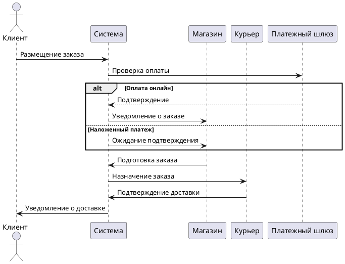
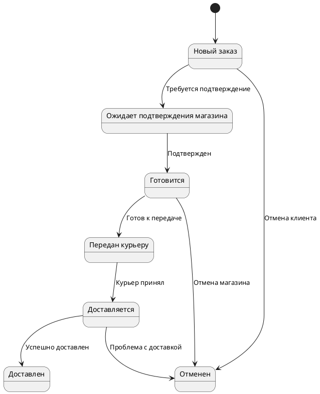
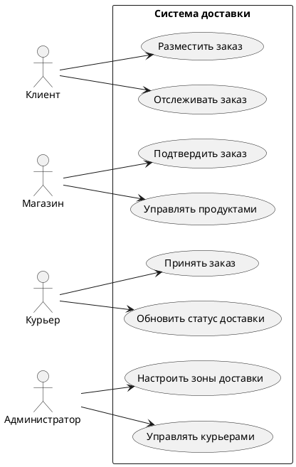

#### **2.3. Бизнес-процессы**  
1. **Оформление заказа**:  
   - Клиент выбирает блюда → система проверяет доступность → назначает курьера → отправляет уведомление ресторану.  

2. **Доставка**:  
   - Курьер получает заказ → система строит маршрут → клиент отслеживает доставку в реальном времени.  

3. **Обратная связь**:  
   - После доставки клиент оценивает сервис → рейтинг влияет на приоритет ресторана в поиске.  
---

### **2.2. Проработка бизнес-процессов**   (предварительный )

В данном разделе рассматриваются основные бизнес-процессы программного комплекса для сервисов доставки еды, включая алгоритм заказа и доставки, интеграцию с платежными системами и геосервисами.  

#### **2.2.1. Алгоритм заказа и доставки**  
Процесс заказа и доставки включает несколько этапов, которые могут варьироваться в зависимости от способа оплаты, необходимости подтверждения магазином или курьером, а также типа доставки (курьерская или самовывоз).  

##### **Основные этапы:**  
1. **Размещение заказа**  
   - Клиент выбирает товары в магазине (только в одном магазине за раз).  
   - Система проверяет доступность товаров и зону покрытия доставки.  
   - Если заказ оплачивается онлайн, он автоматически подтверждается.  

2. **Обработка заказа магазином**  
   - Если включено подтверждение магазином, заказ ожидает подтверждения.  
   - Магазин готовит заказ и передает курьеру.  

3. **Принятие заказа курьером**  
   - Курьер получает уведомление о новом заказе.  
   - Если оплата наложенным платежом, курьер подтверждает заказ.  

4. **Доставка**  
   - Курьер забирает заказ и доставляет клиенту.  
   - Статус заказа обновляется в реальном времени.  

5. **Самовывоз**  
   - Если выбран самовывоз, магазин управляет процессом самостоятельно.  

6. **Запланированные заказы**  
   - Все операции начинаются не позднее чем за 15 минут до времени доставки.  

#### **2.2.2. Интеграция с платежными системами и геосервисами**  
Система поддерживает интеграцию с несколькими платежными шлюзами (Yoocassa, Tinkoff) и геосервисами (Google Maps API).  

##### **Платежные системы:**  
- **Онлайн-оплата:** автоматическое подтверждение заказа.  
- **Наложенный платеж:** подтверждение курьером при доставке.  

##### **Геосервисы:**  
- Определение зоны покрытия магазина.  
- Отображение заказов на карте для курьеров.  
- Расчет маршрута доставки.  

---

### **Диаграммы бизнес-процессов (PlantUML)**  

#### **1. Диаграмма последовательностей (Order Processing)**  

#### **2. Диаграмма состояний заказа (Order Lifecycle)**  

#### **3. Диаграмма вариантов использования (Use Case)**  

---

### **Вывод**  
В данном разделе были проработаны ключевые бизнес-процессы системы доставки еды, включая алгоритм обработки заказов, интеграцию с платежными системами и геосервисами. Диаграммы наглядно демонстрируют жизненный цикл заказа и взаимодействие между участниками системы.