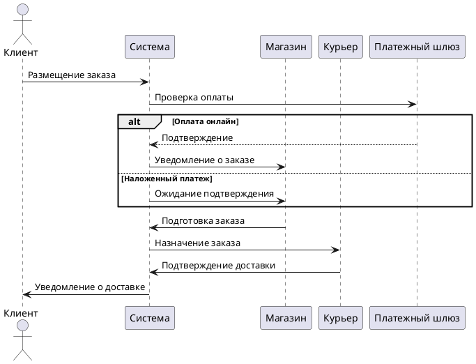
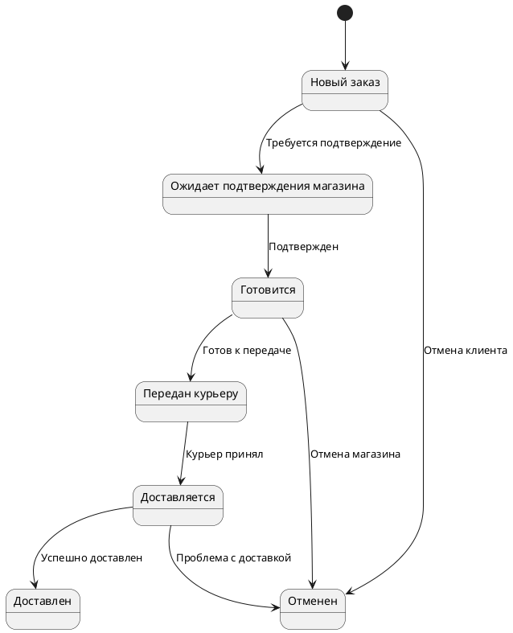
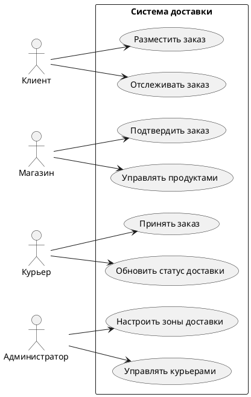

#### **2.3. Бизнес-процессы**  
1. **Оформление заказа**:  
   - Клиент выбирает блюда → система проверяет доступность → назначает курьера → отправляет уведомление ресторану.  

2. **Доставка**:  
   - Курьер получает заказ → система строит маршрут → клиент отслеживает доставку в реальном времени.  

3. **Обратная связь**:  
   - После доставки клиент оценивает сервис → рейтинг влияет на приоритет ресторана в поиске.  
---

### **2.2. Проработка бизнес-процессов**   (предварительный )

В данном разделе рассматриваются основные бизнес-процессы программного комплекса для сервисов доставки еды, включая алгоритм заказа и доставки, интеграцию с платежными системами и геосервисами.  

#### **2.2.1. Алгоритм заказа и доставки**  
Процесс заказа и доставки включает несколько этапов, которые могут варьироваться в зависимости от способа оплаты, необходимости подтверждения магазином или курьером, а также типа доставки (курьерская или самовывоз).  

##### **Основные этапы:**  
1. **Размещение заказа**  
   - Клиент выбирает товары в магазине (только в одном магазине за раз).  
   - Система проверяет доступность товаров и зону покрытия доставки.  
   - Если заказ оплачивается онлайн, он автоматически подтверждается.  

2. **Обработка заказа магазином**  
   - Если включено подтверждение магазином, заказ ожидает подтверждения.  
   - Магазин готовит заказ и передает курьеру.  

3. **Принятие заказа курьером**  
   - Курьер получает уведомление о новом заказе.  
   - Если оплата наложенным платежом, курьер подтверждает заказ.  

4. **Доставка**  
   - Курьер забирает заказ и доставляет клиенту.  
   - Статус заказа обновляется в реальном времени.  

5. **Самовывоз**  
   - Если выбран самовывоз, магазин управляет процессом самостоятельно.  

6. **Запланированные заказы**  
   - Все операции начинаются не позднее чем за 15 минут до времени доставки.  

#### **2.2.2. Интеграция с платежными системами и геосервисами**  
Система поддерживает интеграцию с несколькими платежными шлюзами (Yoocassa, Tinkoff) и геосервисами (Google Maps API).  

##### **Платежные системы:**  
- **Онлайн-оплата:** автоматическое подтверждение заказа.  
- **Наложенный платеж:** подтверждение курьером при доставке.  

##### **Геосервисы:**  
- Определение зоны покрытия магазина.  
- Отображение заказов на карте для курьеров.  
- Расчет маршрута доставки.  

---

### **Диаграммы бизнес-процессов (PlantUML)**  

#### **1. Диаграмма последовательностей (Order Processing)**  

#### **2. Диаграмма состояний заказа (Order Lifecycle)**  

#### **3. Диаграмма вариантов использования (Use Case)**  

---

### **Вывод**  
В данном разделе были проработаны ключевые бизнес-процессы системы доставки еды, включая алгоритм обработки заказов, интеграцию с платежными системами и геосервисами. Диаграммы наглядно демонстрируют жизненный цикл заказа и взаимодействие между участниками системы.

---

### **2.2. Детализация бизнес-процессов платформы доставки**  

#### **Введение**  
Платформа доставки представляет собой многофункциональную экосистему, объединяющую клиентов, магазины, курьеров и администраторов. Основной целью системы является автоматизация и оптимизация процессов оформления, обработки и доставки заказов с учетом различных сценариев взаимодействия.  

В данном разделе детально описываются ключевые бизнес-процессы, включая:  
1. **Оформление и обработку заказа** (включая оплату и подтверждение).  
2. **Управление доставкой** (назначение курьеров, маршрутизация, контроль выполнения).  
3. **Интеграцию с внешними сервисами** (платежные системы, картографические сервисы).  
4. **Особые сценарии** (самовывоз, запланированные заказы, мультиязычность).  

---  

### **1. Процесс оформления и обработки заказа**  

#### **1.1. Создание заказа клиентом**  
1. **Выбор магазина:**  
   - Пользователь выбирает магазин из списка доступных (с учетом зоны покрытия).  
   - Система проверяет, что клиент находится в зоне доставки (на основе геолокации или ручного ввода адреса).  
   - Если магазин недоступен, система уведомляет пользователя.  

2. **Формирование заказа:**  
   - Клиент добавляет товары в корзину, выбирает атрибуты (размер, дополнения и т. д.).  
   - Применяются скидки и акции (если доступны).  
   - Указывается способ получения: *доставка* или *самовывоз*.  

3. **Оплата заказа:**  
   - **Онлайн-оплата:**  
     - Клиент выбирает платежный шлюз (Yoocassa, Tinkoff и др.).  
     - После успешной оплаты заказ автоматически подтверждается и передается в магазин.  
   - **Наложенный платеж:**  
     - Заказ требует подтверждения магазина или курьера (в зависимости от настроек).  

#### **1.2. Подтверждение заказа**  
- Если **включено подтверждение магазина**, заказ поступает на панель магазина для ручной проверки.  
- Если **включено подтверждение курьера**, заказ сначала принимается курьером, затем передается в магазин.  
- При онлайн-оплате заказ автоматически подтверждается и сразу отображается в магазине.  

#### **1.3. Обработка заказа магазином**  
- Магазин получает заказ на панели управления.  
- Если заказ требует приготовления (например, еда), магазин начинает обработку.  
- После готовности заказ передается курьеру (если доставка) или ожидает клиента (при самовывозе).  

---  

### **2. Процесс управления доставкой**  

#### **2.1. Назначение курьера**  
- **Автоматическое назначение:**  
  - Система выбирает ближайшего свободного курьера с подходящим типом транспорта.  
- **Ручное назначение:**  
  - Администратор или менеджер магазина вручную выбирает курьера из списка доступных.  

#### **2.2. Принятие заказа курьером**  
- Курьер получает уведомление о новом заказе через мобильное приложение.  
- Подтверждает заказ (если требуется) и отправляется в магазин.  

#### **2.3. Доставка заказа**  
- Курьер забирает заказ в магазине.  
- При наложенном платеже проверяет сумму и подтверждает получение денег.  
- Доставляет заказ клиенту, отмечает выполнение в системе.  

#### **2.4. Контроль доставки в реальном времени**  
- Администратор и магазин видят статус заказа на карте (интеграция с Google Maps).  
- Клиент получает уведомления о статусе заказа.  

---  

### **3. Интеграция с внешними сервисами**  

#### **3.1. Платежные системы**  
- Поддержка нескольких шлюзов (Yoocassa, Tinkoff и др.).  
- Автоматическая проверка платежа и обновление статуса заказа.  

#### **3.2. Картографические сервисы**  
- Определение зон покрытия магазинов.  
- Построение маршрутов для курьеров.  
- Отображение заказов на карте в реальном времени.  

---  

### **4. Особые сценарии**  

#### **4.1. Самовывоз**  
- Клиент выбирает пункт самовывоза.  
- Магазин готовит заказ и уведомляет клиента о готовности.  
- Клиент забирает заказ самостоятельно.  

#### **4.2. Запланированные заказы**  
- Клиент указывает время доставки.  
- Все процессы (приготовление, доставка) начинаются не позднее чем за 15 минут до указанного времени.  

#### **4.3. Мультиязычность**  
- Панель администратора и магазина поддерживают русский язык.  
- Возможность расширения на другие языки.  

---  

### **Заключение**  
Описанные бизнес-процессы обеспечивают гибкость и масштабируемость платформы доставки. Система адаптируется под различные модели работы (подтверждение магазина/курьера, самовывоз, отложенные заказы) и интегрируется с внешними сервисами для автоматизации ключевых операций.  

Данная структура может быть дополнена UML-диаграммами (Use Case, Activity, Sequence) для визуализации процессов в рамках дипломной работы.