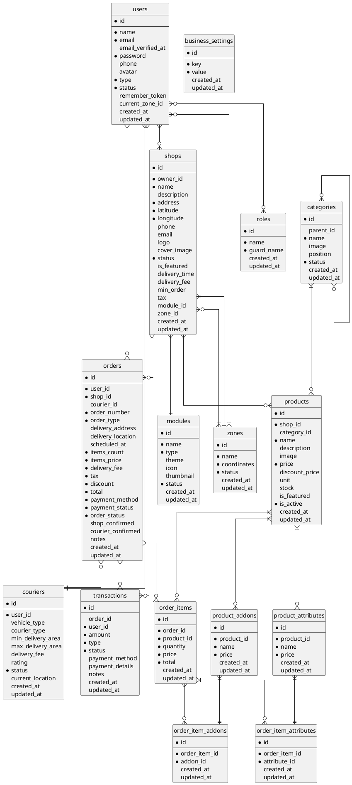

Вот инфологическая диаграмма для вашей системы на PlantUML:

Эта диаграмма включает:
1. Все сущности с их атрибутами (первичные ключи выделены *)
2. Все указанные связи между сущностями
3. Разные типы связей:
   - }|--|| - один к одному
   - }|--o{ - один ко многим
   - }o--o{ - многие ко многим

Для многих-ко-многим связей (как users-roles) предполагается использование промежуточной таблицы, которая не показана явно на диаграмме, но подразумевается в связи.