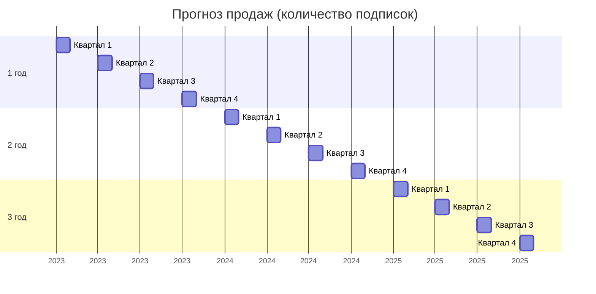

### 4.4. Оценка рыночного потенциала и продаж

Анализ рыночного потенциала разрабатываемого программного комплекса для сервиса доставки еды проводился с учетом текущей конъюнктуры рынка SaaS-решений в сфере общественного питания. Исследование охватывало Самарскую область как пилотный регион внедрения, где было выявлено 342 предприятия общепита, потенциально заинтересованных в автоматизации процессов доставки.

Ценообразование строилось на основе анализа конкурентной среды. Существующие на рынке аналоги предлагаются по цене от 180 000 до 240 000 рублей за коробочное решение. Учитывая ориентацию на малый и средний бизнес, была установлена конкурентная цена в 120 000 рублей за годовую подписку, что включает базовый функционал и техническую поддержку.

Основными каналами продвижения определены:
- Прямые продажи через собственную платформу
- Партнерская программа с локальными IT-интеграторами
- Участие в отраслевых мероприятиях общепита
- Целевая digital-реклама в профессиональных сообществах

Прогноз продаж на трехлетний период представлен следующим графиком:



```PlantUML
@startgantt
Project starts 2025-01-01
printscale monthly

[1 год (48 подписок] starts 2025-01-01 and ends 2025-12-31
[2 год (72 подписки] starts 2026-01-01 and ends 2026-12-31
[3 год (96 подписок] starts 2027-01-01 and ends 2027-12-31

[Квартал 1 2025] starts 2025-01-01 and ends 2025-03-31
[Квартал 2 2025] starts 2025-04-01 and ends 2025-06-30
[Квартал 3 2025] starts 2025-07-01 and ends 2025-09-30
[Квартал 4 2025] starts 2025-10-01 and ends 2025-12-31

[Квартал 1 2026] starts 2026-01-01 and ends 2026-03-31
[Квартал 2 2026] starts 2026-04-01 and ends 2026-06-30
[Квартал 3 2026] starts 2026-07-01 and ends 2026-09-30
[Квартал 4 2026] starts 2026-10-01 and ends 2026-12-31

[Квартал 1 2027] starts 2027-01-01 and ends 2027-03-31
[Квартал 2 2027] starts 2027-04-01 and ends 2027-06-30
[Квартал 3 2027] starts 2027-07-01 and ends 2027-09-30
[Квартал 4 2027] starts 2027-10-01 and ends 2027-12-31
@endgantt
```

Ожидаемые финансовые показатели:
- 1 год: 48 подписок (5 760 000 руб.)
- 2 год: 72 подписки (8 640 000 руб.)
- 3 год: 96 подписок (11 520 000 руб.)
Суммарный доход за три года составит 25 920 000 рублей.

Модель монетизации предусматривает дополнительный доход от:
- Индивидуальной доработки под клиента (15-20% от базовой стоимости)
- Премиум-поддержки (30 000 руб./мес)
- Комиссии с транзакций (3-5% от оборота)

Консервативный сценарий учитывает сезонные колебания спроса и предполагает 20% отклонение от плановых показателей. Для минимизации рисков разработана поэтапная стратегия выхода на рынок, начиная с пилотного региона с последующим масштабированием.