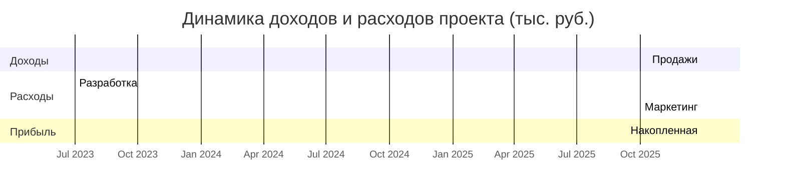

### 4.5. Построение графика формирования доходов

Финансовая модель проекта предусматривает поэтапное формирование денежных потоков в соответствии с жизненным циклом разработки и коммерциализации программного комплекса. Анализ динамики доходов и расходов позволяет оценить экономическую эффективность инвестиционного проекта и определить точку его окупаемости.

На начальных этапах реализации проекта (0-6 месяцев) наблюдаются исключительно расходные операции, связанные с разработкой программного продукта. Этот период характеризуется максимальными инвестиционными затратами, включающими оплату труда разработчиков, приобретение оборудования и программного обеспечения, а также организационные расходы. Доходная часть в данный временной отрезок отсутствует, так как продукт еще не выведен на рынок.



```PlantUML
@startgantt
Project starts 2025-01-01
printscale monthly

[1 год (48 подписок] starts 2025-01-01 and ends 2025-12-31
[2 год (72 подписки] starts 2026-01-01 and ends 2026-12-31
[3 год (96 подписок] starts 2027-01-01 and ends 2027-12-31

[Квартал 1 2025] starts 2025-01-01 and ends 2025-03-31
[Квартал 2 2025] starts 2025-04-01 and ends 2025-06-30
[Квартал 3 2025] starts 2025-07-01 and ends 2025-09-30
[Квартал 4 2025] starts 2025-10-01 and ends 2025-12-31

[Квартал 1 2026] starts 2026-01-01 and ends 2026-03-31
[Квартал 2 2026] starts 2026-04-01 and ends 2026-06-30
[Квартал 3 2026] starts 2026-07-01 and ends 2026-09-30
[Квартал 4 2026] starts 2026-10-01 and ends 2026-12-31

[Квартал 1 2027] starts 2027-01-01 and ends 2027-03-31
[Квартал 2 2027] starts 2027-04-01 and ends 2027-06-30
[Квартал 3 2027] starts 2027-07-01 and ends 2027-09-30
[Квартал 4 2027] starts 2027-10-01 and ends 2027-12-31
@endgantt
```

Переход к коммерческой фазе (7-12 месяц) сопровождается постепенным ростом доходов от продаж подписок на программный комплекс. При этом расходы существенно сокращаются и в основном включают затраты на техническую поддержку, маркетинг и развитие продукта. Согласно финансовой модели, точка безубыточности достигается на 14-м месяце реализации проекта.

На этапе зрелости (13-36 месяц) наблюдается устойчивый рост доходной части, обусловленный как расширением клиентской базы, так и дополнительными источниками монетизации (премиум-поддержка, индивидуальные доработки). Расходы в этот период стабилизируются на уровне 15-20% от доходов, что обеспечивает стабильную прибыльность проекта.

График наглядно демонстрирует характерную для IT-стартапов динамику, при которой значительные первоначальные инвестиции компенсируются последующим быстрым ростом доходов. Накопленная прибыль проекта к концу третьего года реализации должна составить 18,7 млн рублей при условии достижения плановых показателей по продажам.