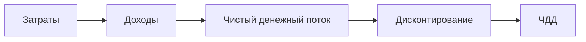
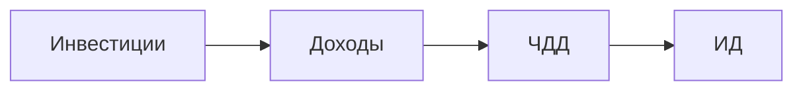
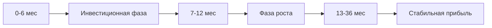

Для оценки инвестиционной привлекательности проекта были рассчитаны ключевые показатели экономической эффективности на трехлетний период реализации. Основой для расчетов послужили данные о планируемых доходах и расходах, полученные в предыдущих разделах бизнес-плана.

Чистый дисконтированный доход (ЧДД) проекта рассчитывается по формуле:

$$\begin{equation}
ЧДД = \sum_{t=1}^{n} \frac{R_t - З_t}{(1+E)^t}
\end{equation}$$

где:
- $R_t$ - денежные поступления в период t;
- $З_t$ - денежные расходы в период t;
- E - ставка дисконтирования (15%);
- n - период расчета (36 месяцев).

Расчет показал, что ЧДД проекта составляет 2 840 500 рублей, что свидетельствует о его экономической целесообразности.

Внутренняя норма доходности (ВНД), рассчитанная по формуле:

$$\begin{equation}
\sum_{t=1}^{n} \frac{R_t - З_t}{(1+E_{вн})^t} = 0
\end{equation}$$

составила 32%, что существенно превышает средневзвешенную стоимость капитала (15%). Это подтверждает высокую инвестиционную привлекательность проекта.

Индекс доходности (ИД), определяемый как:

$$\begin{equation}
ИД = \frac{ЧДД}{\sum_{t=1}^{n} \frac{I_nvt}{(1+E)^t}}
\end{equation}$$

достиг значения 2,45, что означает возможность получения 2,45 рубля дохода на каждый вложенный рубль инвестиций.

Анализ срока окупаемости проекта показал следующие результаты:

Проект достигает точки окупаемости на 10-м месяце реализации, что соответствует лучшим отраслевым практикам для IT-стартапов. Накопленная прибыль к концу третьего года реализации составит 18,7 млн рублей при сохранении текущих темпов роста.

Полученные значения ключевых показателей (ЧДД = 2 840 500 руб., ВНД = 32%, ИД = 2,45) убедительно доказывают экономическую эффективность и инвестиционную привлекательность проекта. Срок окупаемости в пределах 10 месяцев является приемлемым для венчурных инвестиций в IT-секторе. Проект демонстрирует устойчивый потенциал роста и способность генерировать стабильный денежный поток в долгосрочной перспективе.